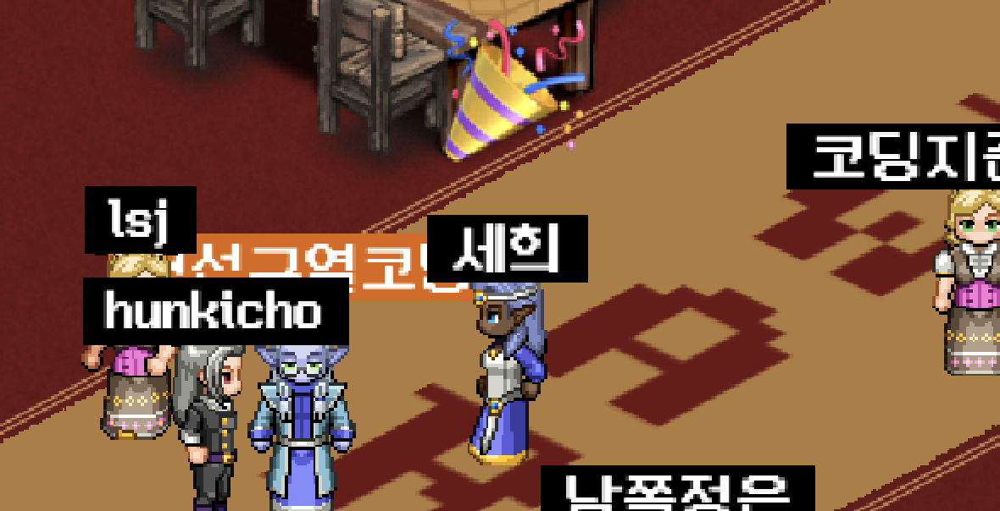
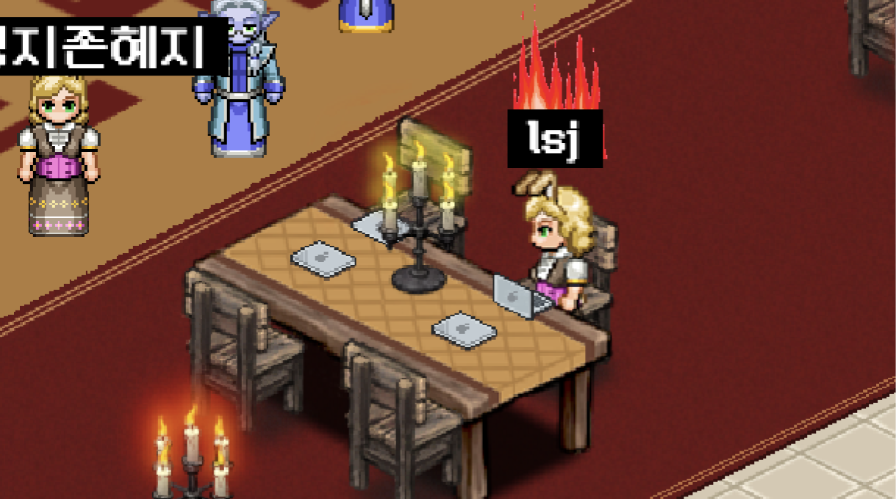

# <strong>Codewarts 🏰 </strong>

코드와트는 알고리즘 문제 풀이에 특화된 온라인 모같코 플랫폼입니다.

*모같코 : 모여서 같이 코딩하기

친구들과 함께 실시간으로 코드를 치며 알고리즘 문제를 맞혀보세요!
<!-- <a href="https://codewarts.store">&nbsp; 👉🏻 코드와트로 날아가기</a>
 -->
  

# <strong>Links 📎 </strong>
코드와트 : https://codewarts.com  
발표 영상 :  
Notion : (?)
  

# <strong>Features 🪄 </strong>

<h2>🔮 실시간 공동 편집 코드 에디터</h2>

- 다른 사람과 함께 코드를 완성해보세요.
- 컴파일 기능으로 코드 출력 결과를 바로 확인할 수도 있어요.

<h2>🔮 알고리즘 문제 제공 및 채점</h2>

- 에디터 내 검색 기능으로 문제를 불러올 수 있어요. 
- 문제 정보를 읽으며 알고리즘 문제를 풀고, 잘 풀었는지 채점도 해보세요!

<h2>🔮 실시간 그림판</h2>

- 실시간으로 코드를 보며 텍스트로는 표현하기 어려운 것을 그려보세요.
- 소통의 질이 높아진 걸 느낄 수 있을거예요.

<h2>🔮 실시간 음성 채팅</h2>

- 강의실과 에디터에서 음성 채팅이 가능합니다! 함께 이야기해보세요.

<h2>🔮 게시판 (리더보드 및 메모)</h2>

- 나를 포함한 코드와트 학생들의 코딩 랭킹을 확인하고 의지를 불태울 수 있어요.
- 메모를 미션 보드처럼 활용해 알고리즘 스터디를 지속해보세요!

<h2>🔮 이모지 & 이펙트</h2>

- 코드와트를 조금 더 재미있게 즐겨보세요! 

  

# <strong>Stacks 📚 </strong></h2>

  

# <strong>Team Codewarts 🧑‍🤝‍🧑 </strong></h2>
|김준철|이은민|염혜지|김세희|한동훈|
|:------:|:-----:|:-----:|:-----:|:-----:|
|사진|사진|사진|사진|사진|사진
|플랫폼 그림판  배포환경 구축|에디터 컴파일  문제 검색 및 채점|플랫폼 UI  문제 풀이 랭킹 및 메모|에디터 로그인  이모지 UI|플랫폼 보이스챗  코드 구조 설계
|[GitHub](https://github.com/juncheolkim)|[GitHub](https://github.com/gcount85)|[GitHub](https://github.com/sententi-a)|[GitHub](https://github.com/sadie100)|[GitHub](https://github.com/mrsuit0114)

  

# <strong>How to start ❓ </strong></h2>

1. **client 디렉토리로 이동해서(cd client), npm install**
2. **server 디렉토리로 이동해서(cd server), npm install**
3. **client 디렉토리 아래에 .env 파일 생성**

   생성하지 않아도 작동은 함. 생성 안할 시 기본 모드로 동작(처음 로그인 화면부터 시작)

   env 파일 양식은 /client/env.txt 참고

4. **server 디렉토리 아래에 .env 파일 생성**

   env 파일 양식은 /server/env.txt 참고

5. **server와 client 실행**

   server: npm run dev
   client: npm start

6. **voice chat deploy server 실행**

   커맨드에 다음 입력

   docker run -p 4443:4443 --rm -e OPENVIDU_SECRET=MY_SECRET openvidu/openvidu-dev:2.25.0

   (개발용이기 때문에 배포 시 새로 파야 함)

  

# <strong>License ℹ️</strong></h2>

캐릭터 이미지 : Wayward

배경음악 : 
https://gongu.copyright.or.kr/gongu/wrt/wrtCl/listWrtSound.do?menuNo=200020 

* 공유마당에 게시된 음원을 합법적으로 사용하기 위한 출처입니다.

bgm1 : https://gongu.copyright.or.kr/gongu/wrt/wrt/view.do?wrtSn=13073758&menuNo=200020

bgm2 : https://gongu.copyright.or.kr/gongu/wrt/wrt/view.do?wrtSn=13048800&menuNo=200026

bgm3 : https://gongu.copyright.or.kr/gongu/wrt/wrt/view.do?wrtSn=13073793&menuNo=200020

