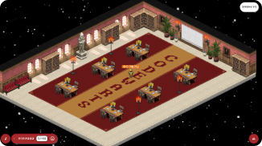
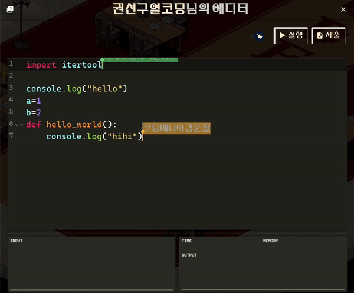
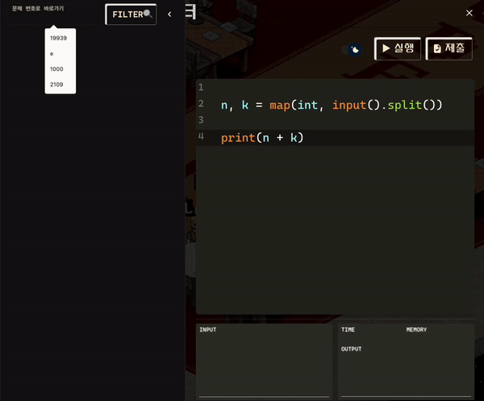
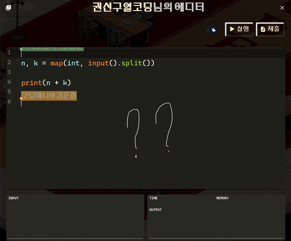
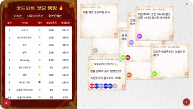

# <strong>Codewarts 🏰 </strong>

<div style="font-size: 20px">코드와트는 알고리즘 문제 풀이에 특화된 온라인 모같코 플랫폼입니다.</div>

<div style="font-size: 14px">*모같코 : 모여서 같이 코딩하기</div>

<div style="text-align: center"></div>
<div style="font-size: 16px">친구들과 함께 실시간으로 코드를 치며 알고리즘 문제를 맞혀보세요!
<a href="https://codewarts.store">&nbsp; 👉🏻 코드와트로 날아가기</a></div>
<br><br>

# <strong>KEY FEATURE 🪄 </strong>

<h2>🔮 실시간 공동 편집 코드 에디터</h2>

컴파일도 가능

<div style="text-align: center"></div>

<h2>🔮 알고리즘 문제 제공 및 채점</h2>

에디터 내 검색 기능으로 문제를 불러올 수 있어요. 문제 정보를 읽으며 알고리즘 문제를 풀고, 잘 풀었는지 채점도 해보세요!

<div style="text-align: center"></div>

<h2>🔮 실시간 그림판</h2>

실시간으로 코드를 보며 그려보세요.

<div style="text-align: center"></div>

<h2>🔮 실시간 음성 채팅</h2>

강의실과 에디터에서 음성 채팅이 가능합니다! 함께 이야기해보세요.

<h2>🔮 게시판 (리더보드 및 메모)</h2>

코드와트 학생들의 코딩 랭킹을 확인하고 의지를 불태울 수 있어요!
알고리즘 스터디를 지속해보세요!

<div style="text-align: center"></div>
<br><br>

# <strong>STACKS 📚 </strong></h2>

<div display="inline-block">


</div>

<br><br>

# <strong>Team Codewarts 🧑‍🤝‍🧑 </strong></h2>
|김준철|이은민|염혜지|한동훈|김세희|
|:------:|:-----:|:-----:|:-----:|:-----:|
|사진|사진|사진|사진|사진|사진
|플랫폼 그림판<br> 배포환경 구축|에디터 컴파일 <br>문제 검색 및 채점|플랫폼 UI <br>문제 풀이 랭킹 및 메모|에디터 로그인 <br>이모지 UI|플랫폼 보이스챗<br> 코드 구조 설계
|[GitHub](https://github.com/juncheolkim)|[GitHub](https://github.com/gcount85)|[GitHub](https://github.com/sententi-a)|[GitHub](https://github.com/mrsuit0114)|[GitHub](https://github.com/sadie100)

<br><br>

# <strong>How to install ❓ </strong></h2>


클라이언트와 서버에서 각각 다음 작업 수행

#### ⚙️Server
```
.env 파일 생성(/server/env.txt 참고)
npm install
npm run dev
```
#### ⚙️Client
```
.env 파일 생성(/client/env.txt 참고)
npm install
npm start
```

<br><br>

# <strong>License</strong></h2>

<div>캐릭터 이미지 : Wayward</div>
<div>배경음악 : 
https://gongu.copyright.or.kr/gongu/wrt/wrtCl/listWrtSound.do?menuNo=200020 </div>
<div style="font-size: 12px">* 공유마당에 게시된 음원을 합법적으로 사용하기 위한 출처입니다.</div>

<div>bgm1 : https://gongu.copyright.or.kr/gongu/wrt/wrt/view.do?wrtSn=13073758&menuNo=200020</div>
<div>bgm2 : https://gongu.copyright.or.kr/gongu/wrt/wrt/view.do?wrtSn=13048800&menuNo=200026</div>
<div>bgm3 : https://gongu.copyright.or.kr/gongu/wrt/wrt/view.do?wrtSn=13073793&menuNo=200020</div>
